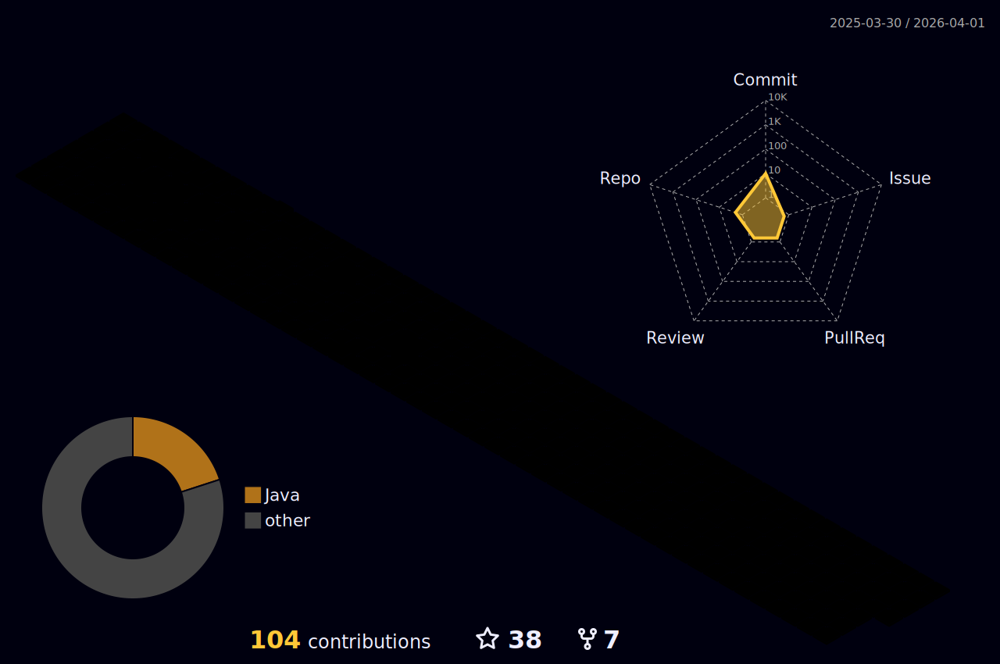

 
    <h2>Olá! Eu sou o Breno Santos 🖐️</h2>
    
    
    
    

 

  

 |  |  |  
 | ----------- | ----------- |

 
<h2>Tecnologias em uso e estudos: </h2>
    
    
    
    
    
    
    
    
    
    
    
    
    
    
    
    
    
    
    
    
    
    
    
    
    

 
<h2>Operating System</h2>
    
    
    
    
    
    
    
   Entre linhas de código e bytes de paixão, meu coração pulsa de amor em 404 dimensões ❤️👩‍💻

 

     

